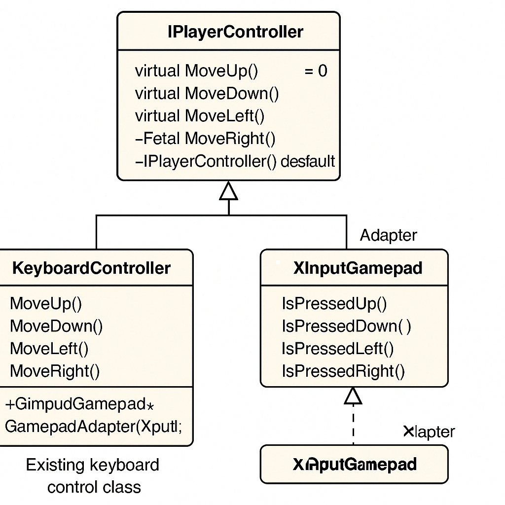

# 🎮 C++ ゲーム開発におけるアダプターパターンの例

## 概要

アダプターパターン（Adapter Pattern）は、互換性のないインターフェース同士をつなぐ「変換器」として働くデザインパターンです。ゲーム開発において、異なる種類の入力デバイス（キーボード、ゲームパッドなど）を統一的なインターフェースで扱いたいときに役立ちます。

---

## 🧩 クラス構成

- `IPlayerController`: 共通のプレイヤー操作インターフェース
- `KeyboardController`: 既存のキーボード用操作クラス
- `XInputGamepad`: ゲームパッド入力を扱う既存API（互換性なし）
- `GamepadAdapter`: `XInputGamepad` を `IPlayerController` に適合させるアダプター

---

## 📊 クラス図（UML）



---

## 🧪 使用例コード（抜粋）

```cpp
void ProcessInput(IPlayerController* controller) {
    controller->MoveUp();
    controller->MoveDown();
    controller->MoveLeft();
    controller->MoveRight();
}

int main() {
    KeyboardController keyboard;
    XInputGamepad xinput;
    GamepadAdapter gamepad(&xinput);

    std::cout << "Using Keyboard:
";
    ProcessInput(&keyboard);

    std::cout << "\nUsing Gamepad:
";
    ProcessInput(&gamepad);

    return 0;
}
```

---

## ✅ メリット

- インターフェースの再設計をせずに拡張できる
- デバイスごとの実装の違いを吸収し、コードの再利用性が向上
- テストやデバッグ時にモックの差し替えが簡単になる

---

## 📝 まとめ

アダプターパターンを活用することで、ゲーム内の入力制御を柔軟に設計でき、複数のデバイス対応が容易になります。
