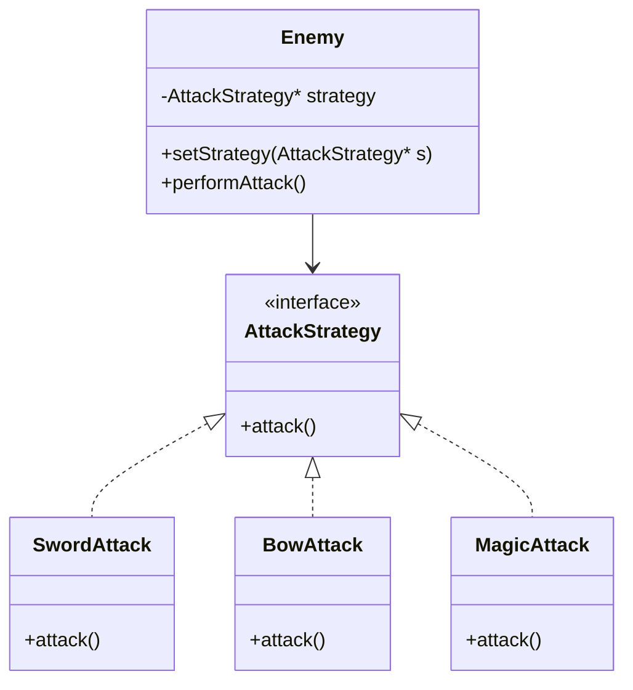

# ストラテジーパターン教材

### 授業計画

#### 授業の目標
- ストラテジーパターンの基本的な概念を理解する。
- 簡単なC++のプログラムを通じて、ストラテジーパターンの使い方を学ぶ。
- ストラテジーとは、戦略という意味である。

#### 授業の流れ
1. **イントロダクション**
   - 授業の目標と概要を説明。
   - デザインパターンとは何かを簡単に説明。

2. **ストラテジーパターンの概念**
   - ストラテジーパターンの基本的な説明。
   - 身近な例を使ってイメージしやすく説明。

3. **簡単なコード例の解説**
   - シンプルなC++のコード例を使ってストラテジーパターンの実装方法を説明。
   - コードの逐次説明と質疑応答。

4. **実習**
   - 学生にストラテジーパターンを用いた簡単なプログラムを作成させる。
   - テーマ例: 決済方法の切り替え、ソートアルゴリズムの切り替えなど。

6. **まとめとQ&A**
   - 授業の内容を振り返り、重要ポイントを再確認。
   - 質疑応答の時間を設ける。

<div style="page-break-after: always;"></div>

---

# イントロダクション


#### デザインパターンとは？

デザインパターンは、プログラミングにおける一般的な問題を解決するためのテンプレートです。
これを使うと、コードが再利用しやすくなり、保守もしやすくなります。

# 🎮 ストラテジーパターンとは？

#### ストラテジーパターンの概要

ストラテジーパターンとは、
「アルゴリズム（処理方法）を、実行時に自由に切り替えられる」ようにするためのデザインパターンです。
つまり、
やり方（戦略＝Strategy）をオブジェクトとして分離し、必要に応じて取り替えられるようにする設計です。

<br>

---

# 🎯 【どんなときに使う？】

- 状況によって行動を切り替えたいとき
- if-elseやswitch文が増えすぎるのを避けたいとき
- 行動を拡張、変更しやすくしたいとき

<div style="page-break-after: always;"></div>

---

# 🎮 ゲームにおけるストラテジーパターンの使いどころ

## 🔥 キャラクターの「行動パターン」を動的に切り替えたいとき

**例：**
- 敵キャラが「通常は歩くけど、怒るとダッシュする」
- ボスが「第一形態では近接攻撃、第二形態では遠距離魔法攻撃」
- プレイヤーが「武器を持ち替えて攻撃方法を変える（剣 → 弓 → 魔法）」

**➡ 状況によって行動方法（戦略）を変えたいときにぴったり！**

---

## 🧠 AI（人工知能）の「行動ロジック」を差し替えたいとき

**例：**
- 敵のAIを「攻撃モード」「防御モード」「逃走モード」などに切り替える。
- NPC（仲間キャラ）が「回復重視AI」から「攻撃重視AI」にスイッチする。

**➡ いろんな思考パターン（行動戦略）を柔軟に入れ替えたいときに使う！**

---

## 🛡️ 武器・スキル・乗り物などの「振る舞い」を交換したいとき

**例：**
- プレイヤーが装備を変更 → 武器の攻撃方法が変わる。
- ロボットゲームで、モジュール（パーツ）を付け替えると、移動方法やジャンプ力が変わる。

**➡ 「何を使うか」で行動が変わる仕組みもストラテジーパターン向き！**

---

# 🏠 【クラス構成】

```text
[Strategy]  // 戦略インターフェース
   ↑
+------------+-------------+
|                         |
[SwordAttack]   [BowAttack]   [MagicAttack]
（剣攻撃）        （弓攻撃）         （魔法攻撃）

[Enemy] // 敵キャラ
→ AttackStrategyを持ち、実行する
```

<div style="page-break-after: always;"></div>

---

## 📊 【クラス図イメージ】



<div style="page-break-after: always;"></div>

---

# ✏️ 【C++ コード例（簡略）】

```cpp
// Strategy インターフェース
class AttackStrategy {
public:
    virtual void attack() = 0;
    virtual ~AttackStrategy() {}
};

// Concrete Strategy
class SwordAttack : public AttackStrategy {
public:
    void attack() override {
        std::cout << "剣で攻撃！" << std::endl;
    }
};

class BowAttack : public AttackStrategy {
public:
    void attack() override {
        std::cout << "弓で攻撃！" << std::endl;
    }
};

class MagicAttack : public AttackStrategy {
public:
    void attack() override {
        std::cout << "魔法で攻撃！" << std::endl;
    }
};

// Context
class Enemy {
private:
    AttackStrategy* strategy;
public:
    Enemy(AttackStrategy* initialStrategy) : strategy(initialStrategy) {}

    void setStrategy(AttackStrategy* newStrategy) {
        strategy = newStrategy;
    }

    void performAttack() {
        strategy->attack();
    }
};
```

<div style="page-break-after: always;"></div>

---

# 💡 【使い方例】

```cpp
int main() {
    SwordAttack sword;
    BowAttack bow;
    MagicAttack magic;

    Enemy enemy(&sword);

    enemy.performAttack();  // 剣で攻撃！

    enemy.setStrategy(&bow);
    enemy.performAttack();  // 弓で攻撃！

    enemy.setStrategy(&magic);
    enemy.performAttack();  // 魔法で攻撃！

    return 0;
}
```

<div style="page-break-after: always;"></div>

---

# ✅ 【ポイントまとめ】

| 項目 | 内容 |
|:----|:----|
| **柔軟性** | ゲーム中に行動を切り替えられる |
| **拡張性** | 新しい行動を追加しやすい |
| **シンプルなコード** | if-elseを減らせる |
| **責任分離** | キャラは行動の詳細を知らない |

---

# 🎮 【実際の応用例】

- **移動戦略** (歩き、走り、テレポート)
- **AI行動戦略** (防御重視、攻撃重視)
- **プレイヤー操作切り替え** (手動、オート)

---

# 🔢 【まとめ】

> **「行動のやり方を自由に交換できる設計」がストラテジーパターン！**

ゲームプログラムでは、さまざまな行動や変化に対応するのに最適なパターンです！