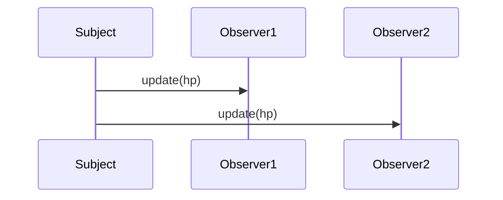

<link rel="stylesheet" href="style.css">

# 🌸 オブザーバーパターンでございますわ 💼✨

## 💎 ご説明いたしますわね

**オブザーバーパターン（Observer Pattern）**とは、あるクラスの状態が変わった際に、それに関係のございます他のクラスへ、優雅に自動で通知をなさるための設計でございますの。

📣 「あるオブジェクトに変化がございましたら、関係者全員にお知らせいたしますのよ」……なんて上品！

---

## 📘 用語のご説明

### 🧍 Subject（サブジェクト）とは？

- 意味：主役・話題の中心。観察される存在ですわ。
- プログラムにおきましては、「変化するクラス」、通知を発する側でございますの。
- 例：HP、スコア、時刻、プレイヤーの状態などですわ。

### 👀 Observer（オブザーバー）とは？

- 意味：観察者・見守り役。
- プログラムでは「通知を受け取って動くクラス」、すなわち受け手でございます。
- 例：UI、サウンドエフェクト、ログ記録など。

> “observe” は「観察する」、 “subject” は「観察される対象」……とっても由緒正しき英語でございますの✨

---

## 🧠 使用場面（ゲームにて）

| 状況 | 例 | 通知先 |
|------|------|-----------------------------|
| プレイヤーのHPが減った時 | HPバー更新 | UI表示、効果音再生クラス |
| アイテムを取得した時 | 所持品へ追加 | UI、ログ、効果音 |
| ステージをクリアした時 | 次ステージ開放 | セーブ処理、演出制御 |

変化がございました際、複数のクラスに同時に優雅に影響を与える必要があるときに、最適ですわ。

---

## 🖼️ 図によるご説明（通知の流れ）



状態が変わりましたら、全てのオブザーバー様に `update()` にてご通知いたしますの💌

---

## 🏗️ クラス構造図（イメージ）

```mermaid
classDiagram
    class Subject {
        +addObserver(Observer*)
        +removeObserver(Observer*)
        +notify()
    }
    class Observer {
        <<interface>>
        +update()
    }

    class HP : Subject {
        -int hp
        +damage()
    }

    class HPBar implements Observer {
        +update()
    }
    class SEPlayer implements Observer {
        +update()
    }

    HP --> Observer
    HPBar ..|> Observer
    SEPlayer ..|> Observer
```

<div style="page-break-after: always;"></div>

---

## 💻 C++によるご実装例

```cpp
#include <iostream>
#include <vector>
#include <algorithm>
using namespace std;

class Observer {
public:
    virtual void update(int hp) = 0;
};

class Subject {
protected:
    vector<Observer*> observers;
public:
    void addObserver(Observer* o) {
        observers.push_back(o);
    }
    void removeObserver(Observer* o) {
        observers.erase(remove(observers.begin(), observers.end(), o), observers.end());
    }
    void notify(int hp) {
        for (Observer* o : observers) o->update(hp);
    }
};

class HP : public Subject {
private:
    int hp = 100;
public:
    void damage(int d) {
        hp -= d;
        if (hp < 0) hp = 0;
        notify(hp);
    }
};

class HPBar : public Observer {
public:
    void update(int hp) override {
        cout << "[HPBar] 残りHPは" << hp << "でございますわ。" << endl;
    }
};

class SEPlayer : public Observer {
public:
    void update(int hp) override {
        cout << "[SEPlayer] ダメージ音を再生いたしますわ。現在HP：" << hp << endl;
    }
};

int main() {
    HP hp;
    HPBar bar;
    SEPlayer se;

    hp.addObserver(&bar);
    hp.addObserver(&se);

    hp.damage(20);
    hp.damage(50);

    return 0;
}
```

<div style="page-break-after: always;"></div>

---

## ❗ 注意点

| 課題 | 解決策 |
|------|--------|
| オブザーバーが増えすぎて管理が大変 | 自動登録／解除処理を設計に含める |
| 通知が多すぎてパフォーマンス低下 | 必要なタイミングだけ通知する工夫 |

---

## 🧭 StrategyやSingletonとの違い

| パターン | 目的 | 関係性 |
|----------|------|---------|
| Strategy | 処理の切り替え | 使う側が戦略を選ぶ |
| Singleton | 唯一のインスタンス | どこからでもアクセス可 |
| Observer | 状態変化の通知 | 登録した全員に自動通知 |

---

## ✅ このパターンの良きところ

- 通知先を増やしても優雅に対応可能
- クラスごとの責務が明確になりますの
- 多数のクラスへ一括で通知できて華麗ですわ💠

---

## 📌 まとめ

- 状態変化に応じて「関係者全員が上品に動く」システムに最適でございます。
- ゲームのUI、SE、ログなど、様々な演出にとても役立ちますの。
- 実装もお上品で分かりやすく、再利用にも向いておりますわ。

> 🎀「イベントが起きたら、お知らせいたしますわね」……それがオブザーバーパターンでございます💐