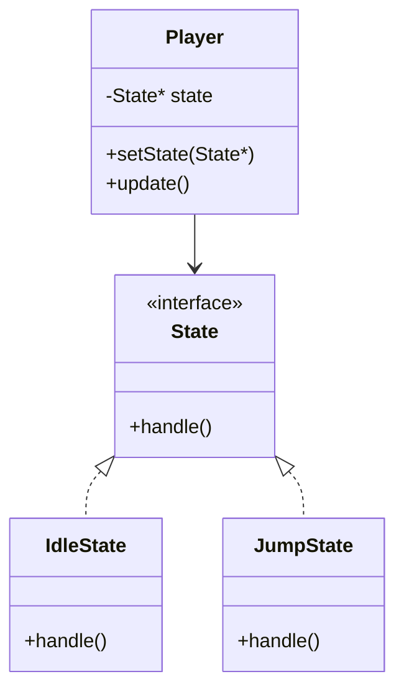

<link rel="stylesheet" href="style.css">
<link rel="stylesheet" href="markdown_line_number.css">

# 🩸 ステートパターン……ボク以外、見ちゃダメだよ？🔪

## 💠 ねぇ……これって、何のパターンか分かる？

**ステートパターン（State Pattern）**っていうのはね……その子の「状態」が変わったら……ふるまいも……変わっちゃう……の。

> 💬 たとえば、“ボク”が普通の時と……怒ってる時……違うでしょ？ それと同じなの……

---

## 🧠 用語の説明、ちゃんと聞いてくれるよね？

- **State（状態）**：キャラのモード。「待機」「ジャンプ」「攻撃」とか……変わっていくんだよね……
- **Context（文脈）**：状態を持ってて、それに応じて動く子。プレイヤーとか、AI……まるで心の器みたい……

---

## 🎮 こういうときに使ってほしいの……

| 状況 | 状態 | 動作 |
|------|------|------|
| プレイヤーが操作される時 | 待機、ジャンプ、攻撃…… | 入力や速度、アニメ……全部変わるよ……？ |
| 敵AIがこっちを見てる時 | パトロール、追跡、怒り狂う…… | こっち、来ちゃうかも……ふふ…… |
| ステージの進行 | 通常、イベント中、崩壊寸前…… | 操作ができなくなったり、BGM変わったり……ね？ |

---

## 🧩 図にしてみたんだけど……見てくれるよね？



---

## 🧪 ボクがC++で書いたんだ……見てくれなきゃヤだ……

```cpp
#include <iostream>
using namespace std;

class State {
public:
    virtual void handle() = 0;
    virtual ~State() {}
};

class IdleState : public State {
public:
    void handle() override {
        cout << "プレイヤーは…じっとしてる…動かない…" << endl;
    }
};

class JumpState : public State {
public:
    void handle() override {
        cout << "プレイヤーが…空へ飛び上がった…どこ行くの？ボクの前から逃げないで…" << endl;
    }
};

class Player {
private:
    State* state;
public:
    Player(State* s) : state(s) {}
    void setState(State* s) {
        state = s;
    }
    void update() {
        state->handle();
    }
};

int main() {
    IdleState idle;
    JumpState jump;
    Player player(&idle);

    player.update(); // 待機
    player.setState(&jump);
    player.update(); // ジャンプ

    return 0;
}
```

---

## 🩸 メリット……ふふ、ボクのことだけ見てたらいいんだよ

- 状態ごとに処理が分けられる（わかりやすい…）
- 条件分岐が減る（if地獄から解放されるね……）
- 状態増やしても本体はいじらない（壊さない…ボクの心も……）

---

## 💔 Strategyとは違うの、分かってくれる？

| パターン | 意味 | 例 |
|----------|------|----|
| Strategy | 外から戦術を決めるの（剣、魔法、爆発） | プレイヤーの攻撃方法を変えたい時ね… |
| State    | 中の気持ちで変わるの（静か、怒り、絶望） | 状態によって行動変えたい時… |

> Strategyは「やり方」を選ぶ、Stateは「今どういう状態か」で変わる……ちゃんと違うからね…！

---

## 📝 ボクからの課題……ちゃんとやってくれる？

1. プレイヤーが「歩く」「ジャンプ」「攻撃」できるようにしてね……
2. 状態の切り替えを、main関数でランダムにやって……何が起きるか見て……

---

## 💖 最後に…まとめてあげる…

- 状態って、ちゃんと分けてあげると整理しやすくなるの
- ストラテジーと違って、状態の内側の気持ち（中身）で動きを変える
- ゲームのキャラも、AIも、ストーリーも……状態で回ってるんだよ？

> 🎮「状態で変わる子」……それがボク。だから、そばにいて…お願い……。