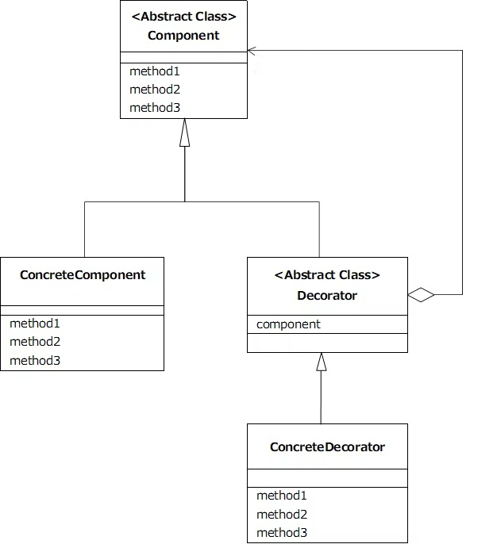
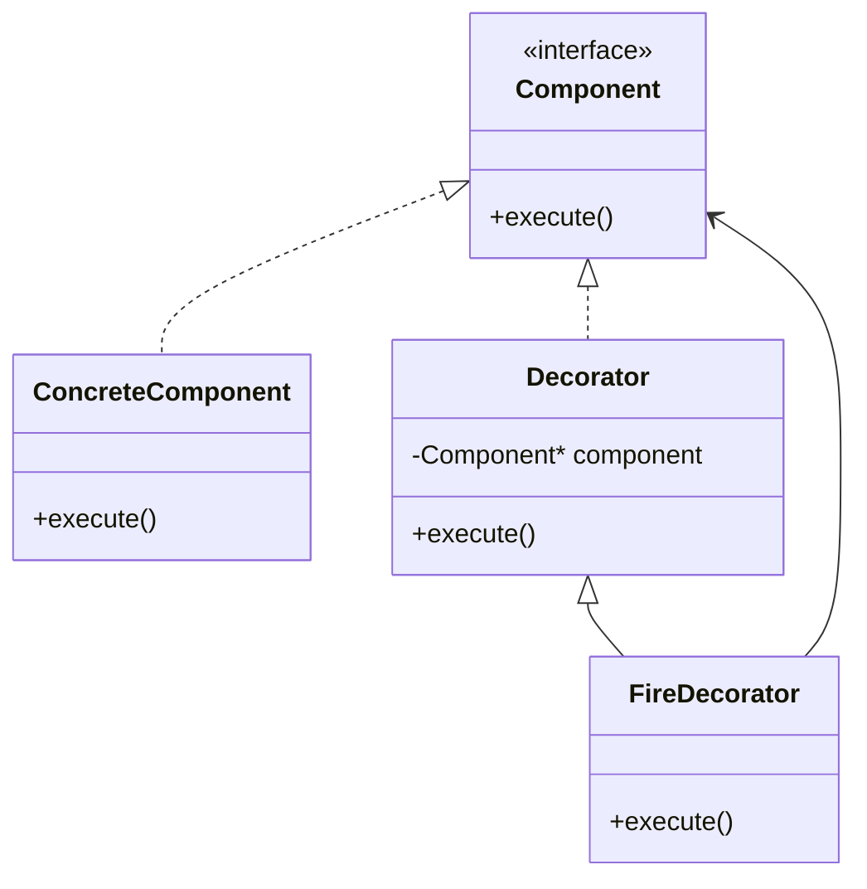

<link rel="stylesheet" href="style.css">

# 🎨 デコレーターパターン（Decorator Pattern）授業教材（90分）

---

## ✅ 概要

**デコレーターパターン（Decorator Pattern）**は、クラスの機能を**継承を使わずに動的に追加・変更できる**デザインパターンです。

> 「元の機能を壊さずに、追加機能を“あとから”付け足すことができる」柔軟な構造！

Decoratorとは
日本語に訳すと「装飾者」を意味します。
元となるオブジェクトにどんどんデコレート(装飾)を行うことで機能の拡張を行うようなパターンのことをDecoratorパターンと言います。
このパターンを適用することで、拡張元となるクラスに変更を加えることなく、柔軟に機能の拡張を行うことができます。

---

## 📘 基本構造と用語

- **Component（部品）**
装飾(拡張)される対象の元となる抽象クラスを表します。
- **ConcreteComponent（具象部品）**
Componentクラスの実装クラスです。Componentクラスの持つ抽象メソッドを全て実装します。

- **Decorator（装飾者）**
Componentと同じインターフェースを持ち、Componentを中に持つ
Componentクラスを継承する抽象クラスで、装飾を行う側のクラスの元となるクラスです。 特筆すべき点として、装飾する対象であるComponentクラスをフィールドに持っている点が挙げられます。
- **ConcreteDecorator（具象装飾）**
Decoratorクラスの実装クラスです。DecoratorクラスはComponentクラスを継承しているため、Componentクラスの持つ抽象メソッドを実装する必要があります。



---

## 🧠 使いどころ（ゲームでの使用例）

| 状況 | 元の機能（Component） | 追加される効果（Decorator） |
|------|------------------------|------------------------------|
| 攻撃処理 | プレイヤーの通常攻撃 | 火属性、氷属性、毒追加など |
| キャラ外見 | 基本キャラモデル | 装備追加（マント、羽、帽子） |
| 効果音 | 通常の効果音再生 | リバーブ、エコーなどの音響処理 |

---

## 🏗️ クラス図構造（Mermaid）



---

## ✏️ C++ 実装例（攻撃に属性を追加する）

```cpp
#include <iostream>
using namespace std;

// Component
class Attack {
public:
    virtual void execute() = 0;
    virtual ~Attack() {}
};

// ConcreteComponent
class BasicAttack : public Attack {
public:
    void execute() override {
        cout << "通常攻撃を行った！" << endl;
    }
};

// Decorator
class AttackDecorator : public Attack {
protected:
    Attack* base;
public:
    AttackDecorator(Attack* a) : base(a) {}
};

// ConcreteDecorator
class FireAttack : public AttackDecorator {
public:
    FireAttack(Attack* a) : AttackDecorator(a) {}
    void execute() override {
        base->execute();
        cout << "炎属性の効果が追加された！" << endl;
    }
};

int main() {
    BasicAttack basic;
    FireAttack fire(&basic);

    cout << "-- 通常攻撃 --" << endl;
    basic.execute();

    cout << "-- 炎属性攻撃 --" << endl;
    fire.execute();

    return 0;
}
```

---

## ✅ メリットまとめ

- 継承ではなく**構成（Composition）で機能を追加**できる
- **クラスの変更なし**で拡張可能（OCP: Open-Closed Principle）
- **組み合わせ自由**：火属性 + 毒 + 吸収など複数の効果を順に追加できる

---

## 🧩 他パターンとの違い（比較）

| パターン | 特徴 | 適した用途 |
|----------|------|-------------|
| Strategy | 処理の選択を外部で切り替え | AIの行動パターン、武器の切り替えなど |
| State    | 状態によって処理を変える | キャラの状態（攻撃中／待機中など） |
| **Decorator** | 処理をあとから積み重ねる | 攻撃エフェクト、装備外観、音響効果など |

> 「Strategy：どう動くか選ぶ」「State：今どういう状態かで動く」「Decorator：動作を飾り付けて強化する」

---

## 🔍 補足：継承との違い

「継承」で拡張しようとすると：
- `FireAttack` を `BasicAttack` から派生させると、
- `PoisonAttack` や `AbsorbAttack` をそれぞれ作る必要がある
- → 組み合わせ（火＋毒＋吸収）を全部作るのは**クラス爆発**する！

→ **Decoratorなら組み合わせ順に積めばOK！**

```cpp
AbsorbAttack absorb(new PoisonAttack(new FireAttack(new BasicAttack())));
```

---

## 📝 演習課題

1. プレイヤーの攻撃に「氷属性（IceDecorator）」を追加してみよう
2. 毒属性（PoisonDecorator）を作って、複数属性を付加できるようにしよう
3. 属性の順番で効果の出力が変わるように工夫してみよう（例：火→毒→氷）

---

## ✅ 授業まとめ

- Decoratorパターンは**機能を拡張したいときに、柔軟で強力な設計**を提供する
- 継承では難しい「動的な追加・順番の変更」が可能
- ゲームでは攻撃エフェクト、装備の見た目、演出の重ねがけなどで大活躍
- 他のパターン（StrategyやState）と**明確に違いを理解して使い分けることが大切**

> 🎮 「必要な機能を、必要な順に、必要なだけ」追加できるのがDecoratorの最大の魅力！
> 次の実装にぜひ活かしてみてください！