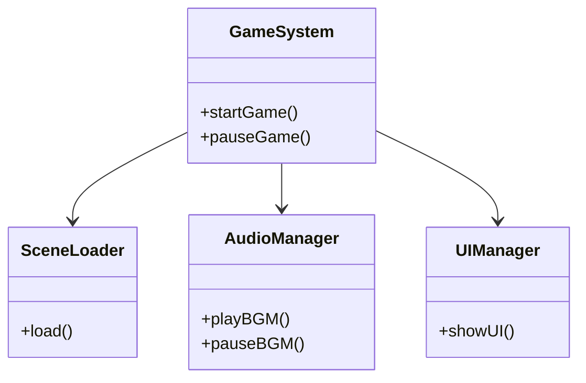

<link rel="stylesheet" href="style.css">

# 🏰 ファサードパターン（Facade Pattern）授業教材（90分）

---

## ✅ 概要

**ファサードパターン（Facade Pattern）**は、複雑なシステムの内部構造を隠して、外部からアクセスしやすくするための**シンプルな窓口（インターフェース）を提供する**デザインパターンです。

> 🎯 「難しい内部処理を、外からは1つのシンプルな関数で操作できるようにする」

---

## 📘 用語整理

- **Facade（ファサード）**：システムの“正面玄関”のようなクラス。中の詳細は見せず、使いやすい操作をまとめて提供する。
- **内部サブシステム**：実際に処理を行う複数のクラス（プレイヤー、UI、サウンドなど）

---

## 🧠 使いどころ（ゲームでの使用例）

| シーン | 内部で必要な処理 | Facadeでまとめる機能例 |
|--------|------------------|---------------------------|
| ゲームの開始 | シーン読み込み / BGM再生 / UI表示 | GameStarter::startGame() |
| ポーズ機能 | 入力停止 / UI表示 / BGM停止 | PauseManager::pause() |
| セーブ処理 | データ収集 / ファイル保存 / 通知表示 | SaveSystem::save() |

---

## 🏗️ クラス図構造（Mermaid）



---

## ✏️ C++ 実装例（ゲーム開始をまとめる）

```cpp
#include <iostream>
using namespace std;

class SceneLoader {
public:
    void load() { cout << "シーンを読み込み中..." << endl; }
};

class AudioManager {
public:
    void playBGM() { cout << "BGMを再生中..." << endl; }
    void pauseBGM() { cout << "BGMを一時停止..." << endl; }
};

class UIManager {
public:
    void showUI() { cout << "UIを表示中..." << endl; }
};

// Facade
class GameSystem {
private:
    SceneLoader loader;
    AudioManager audio;
    UIManager ui;
public:
    void startGame() {
        loader.load();
        audio.playBGM();
        ui.showUI();
    }
    void pauseGame() {
        audio.pauseBGM();
        cout << "ポーズメニューを表示..." << endl;
    }
};

int main() {
    GameSystem game;
    cout << "-- ゲーム開始 --" << endl;
    game.startGame();

    cout << "-- ポーズ --" << endl;
    game.pauseGame();

    return 0;
}
```

---

## ✅ メリットまとめ

- 外部に対して**使いやすいAPIを提供**できる
- **内部構造を隠蔽**し、変更にも強くなる（情報隠蔽）
- 複数の処理を**ひとまとめに呼び出せる**
- コードが読みやすくなる、再利用しやすくなる

---

## 🔄 他パターンとの違い（比較）

| パターン | 目的 | 例 | 備考 |
|----------|------|----|------|
| Facade   | 複雑な処理の簡略化 | ゲーム起動処理 | 外部には簡単に見せたい |
| Mediator | 相互作用の調整 | UIボタン間の通信管理 | 相互依存を減らす設計 |
| Adapter  | インターフェース変換 | 異なる仕様の接続 | 外部ライブラリを統合する場合 |

---

## 📝 演習課題（授業用 or 宿題）

1. シーン切り替え（loadScene）・BGM再生（playMusic）・UI表示（showHUD）をまとめた「GameInitializer」クラスを作成せよ
2. ポーズ時の動作（BGM停止、入力無効、ポーズUI表示）を1関数でまとめてみよう
3. 内部クラスに変更があっても、外から呼び出す関数が変わらないようにしてみよう

---

## ✅ 授業まとめ（90分）

- Facadeパターンは、**複雑な処理をまとめて簡単に使えるようにする設計**
- 内部のサブシステムは変わっても、外部からの呼び出しは変えずに済む
- ゲームの起動・終了・セーブ・ポーズなど、**まとまった一連の処理を簡単に提供する**のに最適
- 他のパターン（Adapter, Mediator）との違いも理解して使い分けることが重要

> 🎮 プレイヤーは“裏側の処理”なんて知らなくていいんです。  
> Facadeで「かんたん操作ボタン」を用意してあげましょう！